# School District Analysis

## Overview
The purpose of this project was to analyze student standardized test performance data and data on school characteristics including size, spending, and type in order to provide insights about performance trends and patterns. The original analysis examined math, reading, and overall test performance for the district as a whole and by individual school; performance by grade level for each school; and performance by school spending per student, school size, and school type. After the discovery of inaccurate math and reading score data for ninth grade students at Thomas High School, all analysis was repeated excluding those scores. The results below outline how the analysis was affected by the exclusion of ninth grade math and reading scores for Thomas High School. The final analysis will be used by leadership at the school and district levels to inform strategic discussions and decision-making.

## Results

All analysis for this project was performed using [student](Resources/students_complete.csv) and [school](Resources/schools_complete.csv) datasets. A [Python script using Pandas in Jupyter Notebook]( PyCitySchools_Challenge.ipynb) was developed to clean and merge the datasets, replace ninth grade math and reading scores for Thomas High School with null values, and perform all analysis.

### District Summary
As shown in the DataFrame images below, after rounding average scores and percentages to the nearest tenth, the overall district performance was affected by the exclusion of ninth grade math and reading scores for Thomas High School as follows:
-    Average math score was lower by 0.1.
-    Average reading score was unchanged.
-    Percentage of students passing math was lower by 0.2 percentage points.
-    Percentage of students passing reading was lower by 0.1 percentage point.
-    Percentage of students passing both math and reading (% Overall Passing) was lower by 0.3 percentage points.

**District Summary – Original**

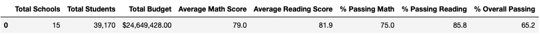

**District Summary – Excluding Thomas High School Ninth Grade**

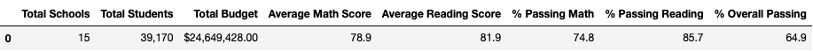

### School Summary
As shown in the school summary DataFrame images below, performance for Thomas High School was affected by the exclusion of ninth grade math and reading scores as follows:
-    Average math score decreased slightly from 83.418349 to 83.350937, which would be no change after rounding to the nearest tenth.
-    Average reading score increased slightly from 83.848930 to 83.896082. which would be an increase of 0.1 after rounding to the nearest tenth.
-    Percentage of students passing math decreased slightly from 93.272171 to 93.185690, which would be a decrease of 0.1 percentage point after rounding to the nearest tenth.
-    Percentage of students passing reading decreased slightly from 97.308869 to 97.018739, which would be a decrease of 0.3 percentage points after rounding to the nearest tenth.
-    Percentage of students passing both math and reading (% Overall Passing) decreased slightly from 90.948012 to 90.630324, which would be a decrease of 0.3 percentage points after rounding to the nearest tenth.

**School Summary – Original**

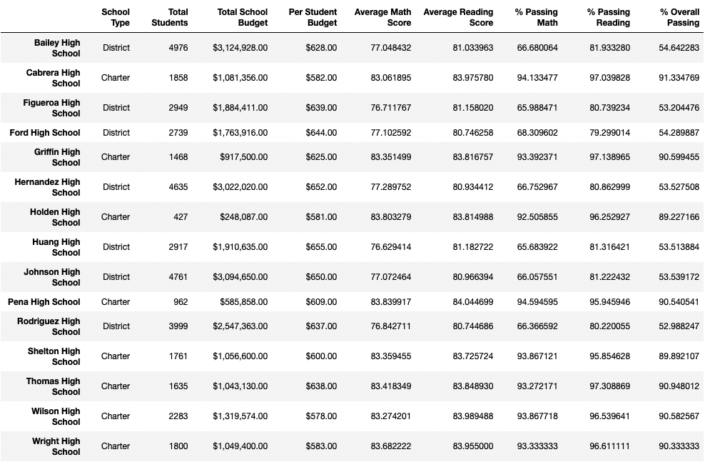

**School Summary – Excluding Thomas High School Ninth Grade**

### Highest Performing Schools
As shown in the images below of the top 5 performing schools based on % Overall Passing, Thomas High School was in the position of second highest performer both in the original analysis and after the exclusion of ninth grade math and reading scores for the school.

**Top 5 Performing Schools – Original**

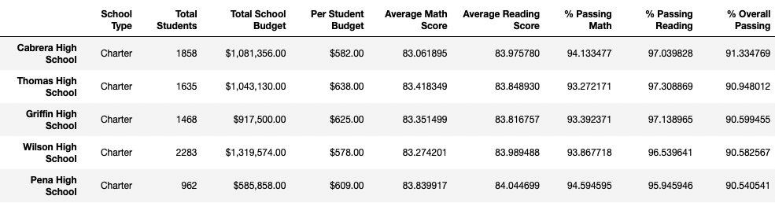

**Top 5 Performing Schools – Excluding Thomas High School Ninth Grade**

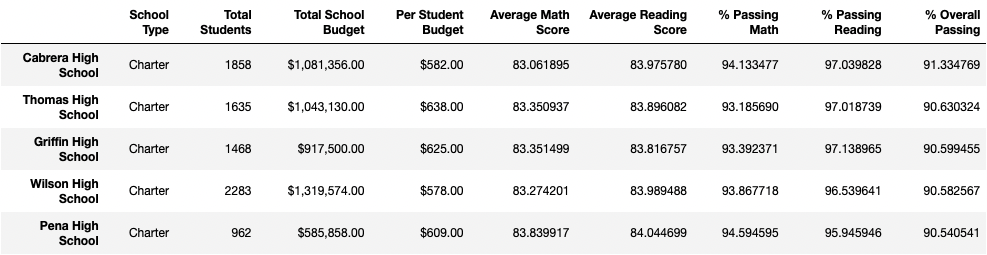

### Scores by Grade Level
As shown in the images below, there is a null value for Thomas High School ninth grade in both the updated average math score by grade level and average reading score by grade level DataFrames due to the exclusion of ninth grade math and reading scores for the school. The original grade level DataFrames had average scores for all schools and grade levels.

**Average Math Score by Grade Level – Original**

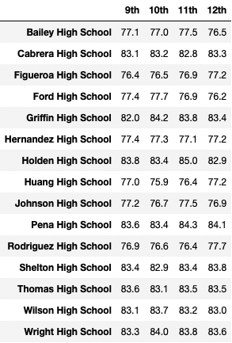

**Average Math Score by Grade Level – Excluding Thomas High School Ninth Grade**

**Average Reading Score by Grade Level – Original**

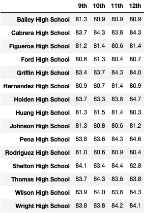

**Average Reading Score by Grade Level – Excluding Thomas High School Ninth Grade**

### Scores by School Spending Per Student
As shown in the DataFrame images below, after rounding average scores and percentages to the nearest tenth, performance for schools spending $630-644 per student (Thomas High School’s spending range) was affected by the exclusion of ninth grade math and reading scores for Thomas High School as follows:
-    Percentage of students passing reading was lower by 0.1 percentage point.
-    Percentage of students passing both math and reading (% Overall Passing) was lower by 0.1 percentage point.
-    No other average scores or percentages were affected.

**Performance by School Spending Per Student – Original**

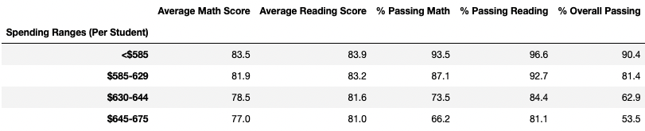

**Average Reading Score by Grade Level – Excluding Thomas High School Ninth Grade**

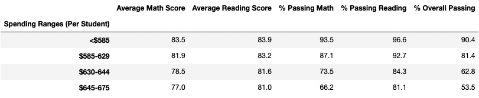

### Scores by School Size
As shown in the DataFrame images below, after rounding average scores and percentages to the nearest tenth, the percentage of students passing reading at medium-sized schools (Thomas High School’s size category) decreased by 0.1 percentage point with the exclusion of ninth grade math and reading scores for Thomas High School. This was the only effect of the exclusion on the analysis by school size.

**Performance by School Spending Per Student – Original**

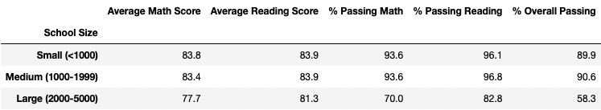

**Average Reading Score by Grade Level – Excluding Thomas High School Ninth Grade**

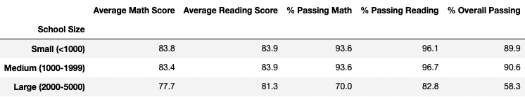

### Scores by School Type
As shown in the DataFrame images below, the exclusion of ninth grade math and reading scores for Thomas High School, a charter school, had no effect on the average scores and percentages in the analysis by school type after rounding to the nearest tenth.

**Performance by School Type – Original**

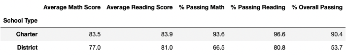

**Performance by School Type – Excluding Thomas High School Ninth Grade**

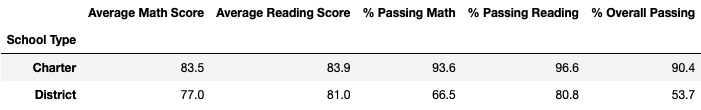

## Summary
Overall, the effect of excluding math and reading scores for ninth grade students at Thomas High School and replacing them with null values was minimal. Based on numbers rounded to the nearest tenth, there was a slight decrease of 0.3 percentage points for students passing both math and reading (% Overall Passing) for both the district as a whole and Thomas High School individually. The percentage of students passing math decreased very slightly at the district level and for Thomas Hight School, as did the percentage of students passing reading. Average math scores were very slightly lower when looking at overall district performance but unchanged when looking at Thomas High School’s individual performance. Average reading scores were unchanged for the district as a whole, but slightly higher for Thomas High School. The effect on the performance by school spending per student, school size, and school type, was similarly minimal or no effect at all.
